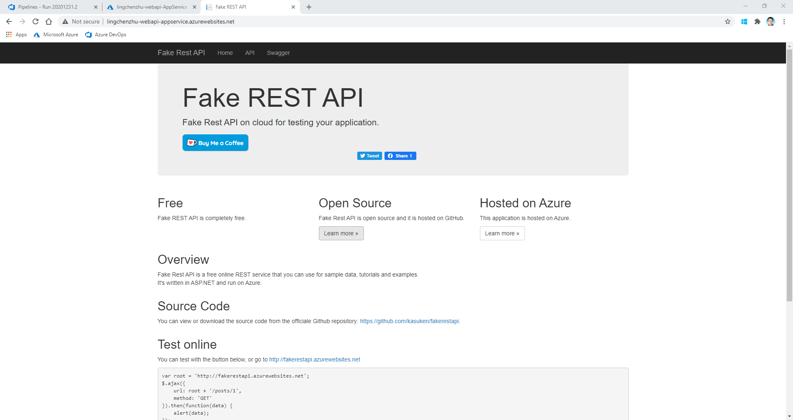

[](https://dev.azure.com/lingchenzhu/Azure-Cloud-DevOps-Ensuring-Quality-Releases/_build/latest?definitionId=3&branchName=main)

# Udacity DevOps Engineer for Microsoft Azure Nanodegree Program <br/><br/> Project: Ensuring Quality Releases

## Instructions

1. Create a Service Principal for Terraform named `TerraformSP` by: `az ad sp create-for-rbac --role="Contributor" --name="TerraformSP"`, and such command outputs 5 values: `appId`, `displayName`, `name`, `password`, and `tenant`.

   Insert these information to [terraform/environments/test/main.tf](terraform/environments/test/main.tf), where `client_id` and `client_secret` are `appId` and `password`, respectively, as well as `tenant_id` is Azure Tenant ID and `subscription_id` is the Azure Subscription ID and both can be retrieved from the command `az account show` (`subscription_id` is the `id` key of `az account show`).

   ```
   provider "azurerm" {
     tenant_id       = "${var.tenant_id}"
     subscription_id = "${var.subscription_id}"
     client_id       = "${var.client_id}"
     client_secret   = "${var.client_secret}"
     features {}
   }
   ```

   Since it is not a good practice to expose these sensitive Azure account information to the public github repo, we define them in the terraform variable definition file terraform/environments/test/terraform.tfvars and avoid tracking such file to the repo. Instead, we upload such file to Pipelines >> Library >> Secure files and download it in the Azure Pipelines YAML config file [azure-pipelines.yml](azure-pipelines.yml) with a DownloadSecureFile@1 task.

   

2. [Configure the storage account and state backend.](https://docs.microsoft.com/en-us/azure/developer/terraform/store-state-in-azure-storage)

    For the sake of simplicity, run the bash script [config_storage_account.sh](config_storage_account.sh) in the local computer. Then replace the values below in [terraform/environments/test/main.tf](terraform/environments/test/main.tf) with the output from the Azure CLI in a block as

    ```
    terraform {
        backend "azurerm" {
            resource_group_name  = "${var.resource_group}"
            storage_account_name = "tstate12785"
            container_name       = "tstate"
            key                  = "terraform.tfstate"
        }
    }
    ```

3. Fill in the correct information in [terraform/environments/test/main.tf](terraform/environments/test/main.tf) and the corresponding modules.

4. [Install Terraform Azure Pipelines Extension by Microsoft DevLabs.](https://marketplace.visualstudio.com/items?itemName=ms-devlabs.custom-terraform-tasks)

5. Create a new Service Connection by Project Settings >> Service connections >> New service connection >> Azure Resource Manager >> Next >> Service Principal (Automatic) >> Next >> Choose the correct subscription, and name such new service connection to Azure Resource Manager as `azurerm-sc`. This name will be used in [azure-pipelines.yml](azure-pipelines.yml).


6. Add TerraformTaskV1@0 tasks to perform `terraform init` and `terraform apply` in [azure-pipelines.yml](azure-pipelines.yml) to let them run in the Azure Pipelines build agent as if running in the local computer.

7. Build FakeRestAPI artifact by archiving the entire fakerestapi directory into a zip file and publishing the pipeline artifact to the artifact staging directory.

8. Deploy FakeRestAPI artifact to the terraform deployed Azure App Service. The deployed webapp URL is [http://lingchenzhu-webapi-appservice.azurewebsites.net/](http://lingchenzhu-webapi-appservice.azurewebsites.net/) where `lingchenzhu-webapi-appservice` is the Azure App Service resource name in small letters.



9. After terraform deployed the virtual machine in Azure Pipelines, we need to manually register such virtual machine in Pipelines >> Environments >> TEST >> Add resource >> Select "Virtual machines" >> Next >> In Operating system, select "Linux". Then copy the Registration script, manually ssh login to the virtual machine, paste it in the console and run. Such registration script makes the deployed Linux virtual machine an Azure Pipelines agent so Azure Pipelines can run bash commands there.


10. Then Azure Pipelines can run bash commands on the virtual machine deployed by terraform.

11. [Create an Azure Log Analytics workspace.](https://docs.microsoft.com/en-us/azure/azure-monitor/learn/quick-create-workspace-cli)

    Run [deploy_log_analytics_workspace.sh](deploy_log_analytics_workspace.sh), or directly call `az deployment group create --resource-group udacity-ensuring-quality-releases --name deploy-log --template-file deploy_log_analytics_workspace.json`, and provide a string value for the parameter `workspaceName`, say `udacity-ensuring-quality-releases-log`.